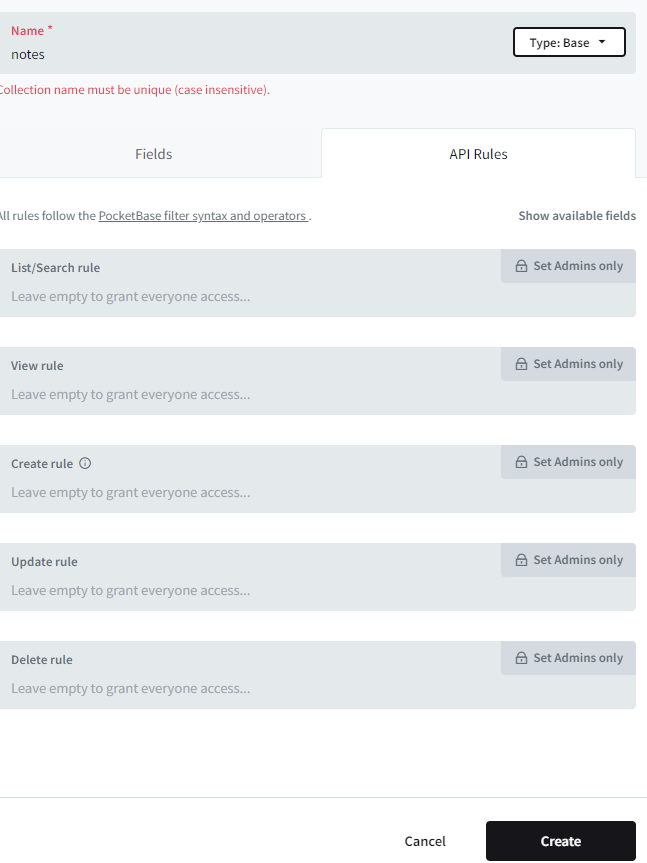

This is a [Next.js](https://nextjs.org/) project bootstrapped with [`create-next-app`](https://github.com/vercel/next.js/tree/canary/packages/create-next-app).

## Getting Started

First, run the development server:

```bash
npm run db-start
# then
npm run dev

```
Open [http://127.0.0.1:8090/_/](http://127.0.0.1:8090/_/) to get access to the admin UI pocketbase

You should create New collection as showed on screenshot 
And make your API operations public 
Open [http://localhost:3000](http://localhost:3000) with your browser to see the result.
